```mermaid
erDiagram
    TEMAS ||--o{ SUB_TEMAS : contem
    SUB_TEMAS ||--o{ AREAS : contem
    AREAS ||--o{ INDICADORES : contem
    INDICADORES ||--o{ DADOS_INDICADORES : possui
    DADOS_INDICADORES }|--|| INDICADOR_DIMENSOES_BRIDGE : tem
    DIMENSOES ||--|{ INDICADOR_DIMENSOES_BRIDGE : associada

    TEMAS {
        UUID id_tema PK
        VARCHAR codigo UK
        VARCHAR nome_pt
        VARCHAR nome_en
        TEXT descricao_pt
        TEXT descricao_en
        VARCHAR icone
        VARCHAR cor_tema
        JSONB metadata
        INTEGER ordem
        BOOLEAN ativo
        VARCHAR slug_pt
        VARCHAR slug_en
        TIMESTAMP created_at
        TIMESTAMP updated_at
    }

    SUB_TEMAS {
        UUID id_sub_tema PK
        UUID id_tema FK
        VARCHAR codigo UK
        VARCHAR nome_pt
        VARCHAR nome_en
        TEXT descricao_pt
        TEXT descricao_en
        LTREE path
        JSONB metadata
        INTEGER ordem
        BOOLEAN ativo
        VARCHAR slug_pt
        VARCHAR slug_en
        TIMESTAMP created_at
        TIMESTAMP updated_at
    }

    AREAS {
        UUID id_area PK
        UUID id_sub_tema FK
        VARCHAR codigo UK
        VARCHAR nome_pt
        VARCHAR nome_en
        TEXT descricao_pt
        TEXT descricao_en
        VARCHAR icone
        LTREE path
        JSONB metadata
        INTEGER ordem
        BOOLEAN ativo
        VARCHAR slug_pt
        VARCHAR slug_en
        TIMESTAMP created_at
        TIMESTAMP updated_at
    }

    INDICADORES {
        UUID id_indicador PK
        UUID id_area FK
        VARCHAR codigo UK
        VARCHAR nome_pt
        VARCHAR nome_en
        TEXT descricao_pt
        TEXT descricao_en
        VARCHAR unidade
        ENUM tipo_valor
	ENUM estado
        ENUM periodicidade
        VARCHAR fonte
        TEXT metodologia_pt
        TEXT metodologia_en
        TEXT formula
        UUID[] dimensoes_aplicaveis
        JSONB metadata
        JSONB configuracao_visualizacao
        JSONB configuracao_olap
        TEXT[] palavras_chave_pt
        TEXT[] palavras_chave_en
        NUMERIC valor_minimo
        NUMERIC valor_maximo
        INTEGER precision_scale
        INTERVAL frequencia_atualizacao
        TIMESTAMP ultima_atualizacao
        TIMESTAMP proxima_atualizacao
        INTEGER versao
        BOOLEAN ativo
        TIMESTAMP created_at
        TIMESTAMP updated_at
    }

    DADOS_INDICADORES {
        UUID id_dado PK
        UUID id_indicador FK
        NUMERIC valor_numerico
        TEXT valor_texto
        DATE periodo_inicio
        DATE periodo_fim
        ENUM periodicidade
        VARCHAR qualidade_dado
        NUMERIC nivel_confianca
        VARCHAR fonte_dados
        TIMESTAMP data_importacao
        INTEGER versao_dado
        INTEGER ano_referencia
        INTEGER mes_referencia
        TIMESTAMP created_at
        TIMESTAMP updated_at
    }

    DIMENSOES {
        UUID id_dimensao PK
        UUID id_parent FK
        ENUM tipo
        VARCHAR codigo
        VARCHAR nome_pt
        VARCHAR nome_en
        VARCHAR valor
        LTREE hierarquia
        INTEGER nivel
        INTEGER ordem
        DATE data_inicio
        DATE data_fim
        JSONB metadata
        BOOLEAN ativo
        TIMESTAMP created_at
        TIMESTAMP updated_at
    }

    INDICADOR_DIMENSOES_BRIDGE {
        UUID id_bridge PK
        UUID id_dado FK
        UUID id_dimensao FK
        ENUM tipo_dimensao
        VARCHAR valor_dimensao
        TIMESTAMP created_at
    }
```

## Diagrama do Modelo de Dados



## Explicação do Datawarehouse

### 1. Estrutura Dimensional Clara

#### Exemplo para o turismo:

**Fatos (DADOS_INDICADORES):**
- Métricas como "Dormidas", "RevPAR", "Taxa ocupação"
- Valores numéricos e temporais
- Ligação com dimensões via bridge

**Dimensões:**
1. Tipo Estabelecimento (Snowflake - hierárquica)
2. Temporal (Star - plana)
3. Geográfica (Star - plana)
4. Categoria Profissional (Star - plana)

### 2. Características típicas de DW
- Views materializadas para agregações
- Particionamento por período
- Otimizações para queries analíticas
- Foco em performance de consulta
- Suporte a análise histórica

### 3. Volume e Escalabilidade

Volume Total (dados não reais) = Nº Indicadores × Nº períodos × Cardinalidade dimensões × Fator esparsidade

**Exemplo:** 40 × 12 × 200 × 11 × 6 × 0.3 ≈ 1.900.000 registos/ano

### 4. Implementação Híbrida
- **Star Schema:** Dimensões diretas (Temporal, Geográfica)
- **Snowflake:** Hierarquias em Estabelecimentos
- **Bridge Tables:** Para dimensões dinâmicas

### 5. Otimizações DW
- Particionamento por tipo e período
- Índices otimizados para análise
- Views materializadas para performance
- Tempos de resposta otimizados (<100ms vs >1s)

### 6. Classificação final
- Combina os benefícios do Star e Snowflake
- Usa bridge tables para flexibilidade
- Mantém performance analítica
- Suporta crescimento e complexidade

## Exemplo Prático - Turismo

### Tabela de FATOS (métricas)
```sql
TABELA dados_indicadores
 dormidas: 500 -- Métrica principal
 valor_anterior: 450 -- Para análise
 periodo_referencia: 2023 -- Temporal
```

### DIMENSÕES (perspetivas de análise)
```sql
DIMENSAO temporal
 2023
 1º Semestre
 Janeiro

DIMENSAO estabelecimento
 Alojamento Turístico
 -> Hotelaria
 -> 3 Estrelas

DIMENSAO geografica
 RAM
 -> Funchal
```

### BRIDGE (liga fatos às dimensões)
```sql
dormidas (500) -> 2023, 1S, ALOJ_TUR, HOTELARIA, ***, RAM, FUNCHAL
```

## Comparação com Base de Dados Relacional

### Sistema Operacional Hotel
```sql
TABELA reservas
 id_reserva
 id_cliente
 id_quarto
 data_entrada
 data_saida
 valor

TABELA quartos
 id_quarto
 numero
 tipo
 status

TABELA clientes
 id_cliente
 nome
 contacto
 nacionalidade
```

**Características:**
- Foco: Gerir reservas diárias
- Updates frequentes
- Dados atuais/operacionais

## Vantagens do Modelo DW

### 1. Análise Multidimensional
- "Quantas dormidas por tipo de hotel?"
- "Dormidas por região e período?"
- "Evolução das dormidas em hotéis 3 estrelas no Funchal?"

### 2. Histórico e Agregações
- Total anual
- Média por município
- Comparação entre períodos

### 3. Navegação Hierárquica
- RAM -> Funchal
- Alojamento -> Hotelaria -> 3 Estrelas
- Ano -> Semestre -> Mês

## Exemplo de Consulta

### Sistema Operacional (Complexo)
No sistema operacional (base relacional), você precisa de várias tabelas e JOINs complexos para responder: 
> "Quantas dormidas tivemos em hotéis 3 estrelas no Funchal no 1º semestre de 2023?"

### Data Warehouse (Simples)
```sql
dormidas WHERE {
 periodo = "2023-1S" AND
 estabelecimento = "3 estrelas" AND
 local = "Funchal"
}
```

## Diferença Principal
- **Base Relacional:** "Gerir reservas do hotel"
- **Data Warehouse:** "Analisar tendências do turismo"
