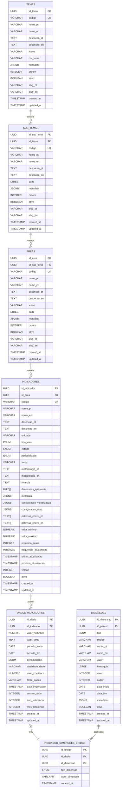

```mermaid
erDiagram
    TEMAS ||--o{ SUB_TEMAS : contem
    SUB_TEMAS ||--o{ AREAS : contem
    AREAS ||--o{ INDICADORES : contem
    INDICADORES ||--o{ DADOS_INDICADORES : possui
    DADOS_INDICADORES }|--|| INDICADOR_DIMENSOES_BRIDGE : tem
    DIMENSOES ||--|{ INDICADOR_DIMENSOES_BRIDGE : associada

    TEMAS {
        UUID id_tema PK
        VARCHAR codigo UK
        VARCHAR nome_pt
        VARCHAR nome_en
        TEXT descricao_pt
        TEXT descricao_en
        VARCHAR icone
        VARCHAR cor_tema
        JSONB metadata
        INTEGER ordem
        BOOLEAN ativo
        VARCHAR slug_pt
        VARCHAR slug_en
        TIMESTAMP created_at
        TIMESTAMP updated_at
    }

    SUB_TEMAS {
        UUID id_sub_tema PK
        UUID id_tema FK
        VARCHAR codigo UK
        VARCHAR nome_pt
        VARCHAR nome_en
        TEXT descricao_pt
        TEXT descricao_en
        LTREE path
        JSONB metadata
        INTEGER ordem
        BOOLEAN ativo
        VARCHAR slug_pt
        VARCHAR slug_en
        TIMESTAMP created_at
        TIMESTAMP updated_at
    }

    AREAS {
        UUID id_area PK
        UUID id_sub_tema FK
        VARCHAR codigo UK
        VARCHAR nome_pt
        VARCHAR nome_en
        TEXT descricao_pt
        TEXT descricao_en
        VARCHAR icone
        LTREE path
        JSONB metadata
        INTEGER ordem
        BOOLEAN ativo
        VARCHAR slug_pt
        VARCHAR slug_en
        TIMESTAMP created_at
        TIMESTAMP updated_at
    }

    INDICADORES {
        UUID id_indicador PK
        UUID id_area FK
        VARCHAR codigo UK
        VARCHAR nome_pt
        VARCHAR nome_en
        TEXT descricao_pt
        TEXT descricao_en
        VARCHAR unidade
        ENUM tipo_valor
	ENUM estado
        ENUM periodicidade
        VARCHAR fonte
        TEXT metodologia_pt
        TEXT metodologia_en
        TEXT formula
        UUID[] dimensoes_aplicaveis
        JSONB metadata
        JSONB configuracao_visualizacao
        JSONB configuracao_olap
        TEXT[] palavras_chave_pt
        TEXT[] palavras_chave_en
        NUMERIC valor_minimo
        NUMERIC valor_maximo
        INTEGER precision_scale
        INTERVAL frequencia_atualizacao
        TIMESTAMP ultima_atualizacao
        TIMESTAMP proxima_atualizacao
        INTEGER versao
        BOOLEAN ativo
        TIMESTAMP created_at
        TIMESTAMP updated_at
    }

    DADOS_INDICADORES {
        UUID id_dado PK
        UUID id_indicador FK
        NUMERIC valor_numerico
        TEXT valor_texto
        DATE periodo_inicio
        DATE periodo_fim
        ENUM periodicidade
        VARCHAR qualidade_dado
        NUMERIC nivel_confianca
        VARCHAR fonte_dados
        TIMESTAMP data_importacao
        INTEGER versao_dado
        INTEGER ano_referencia
        INTEGER mes_referencia
        TIMESTAMP created_at
        TIMESTAMP updated_at
    }

    DIMENSOES {
        UUID id_dimensao PK
        UUID id_parent FK
        ENUM tipo
        VARCHAR codigo
        VARCHAR nome_pt
        VARCHAR nome_en
        VARCHAR valor
        LTREE hierarquia
        INTEGER nivel
        INTEGER ordem
        DATE data_inicio
        DATE data_fim
        JSONB metadata
        BOOLEAN ativo
        TIMESTAMP created_at
        TIMESTAMP updated_at
    }

    INDICADOR_DIMENSOES_BRIDGE {
        UUID id_bridge PK
        UUID id_dado FK
        UUID id_dimensao FK
        ENUM tipo_dimensao
        VARCHAR valor_dimensao
        TIMESTAMP created_at
    }
```