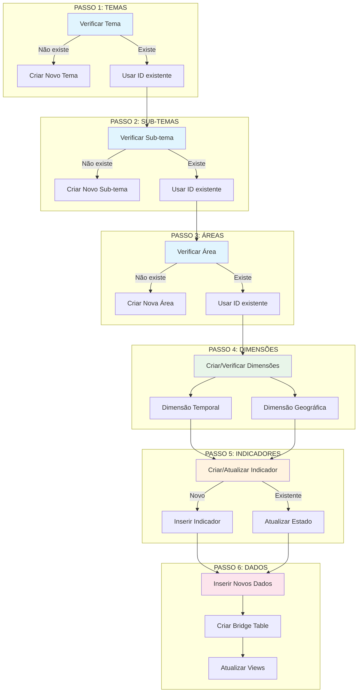

```mermaid
flowchart TD
    subgraph "PASSO 1: TEMAS"
        A[Verificar Tema] -->|Não existe| B[Criar Novo Tema]
        A -->|Existe| C[Usar ID existente]
    end

    subgraph "PASSO 2: SUB-TEMAS"
        C --> D[Verificar Sub-tema]
        D -->|Não existe| E[Criar Novo Sub-tema]
        D -->|Existe| F[Usar ID existente]
    end

    subgraph "PASSO 3: ÁREAS"
        F --> G[Verificar Área]
        G -->|Não existe| H[Criar Nova Área]
        G -->|Existe| I[Usar ID existente]
    end

    subgraph "PASSO 4: DIMENSÕES"
        I --> J[Criar/Verificar Dimensões]
        J --> K[Dimensão Temporal]
        J --> L[Dimensão Geográfica]
    end

    subgraph "PASSO 5: INDICADORES"
        K & L --> M[Criar/Atualizar Indicador]
        M -->|Novo| N[Inserir Indicador]
        M -->|Existente| O[Atualizar Estado]
    end

    subgraph "PASSO 6: DADOS"
        N & O --> P[Inserir Novos Dados]
        P --> Q[Criar Bridge Table]
        Q --> R[Atualizar Views]
    end

    style A fill:#e1f5fe
    style D fill:#e1f5fe
    style G fill:#e1f5fe
    style J fill:#e8f5e9
    style M fill:#fff3e0
    style P fill:#fce4ec
```