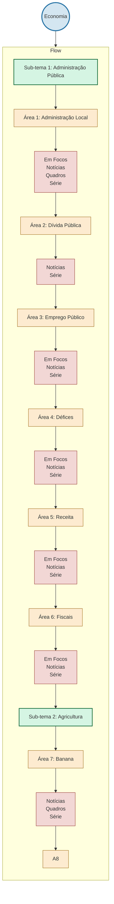

```mermaid
graph TB
    %% Main Theme
    E((Economia))
    
    %% Flow direction setup
    E --> Flow

    %% Sequential flow
    subgraph Flow
        direction TB
        %% Sub-tema 1
        ST1[Sub-tema 1: Administração Pública] --> A1
        A1[Área 1: Administração Local] --> A1F[Em Focos<br>Notícias<br>Quadros<br>Série]
        A1F --> A2
        A2[Área 2: Dívida Pública] --> A2F[Notícias<br>Série]
        A2F --> A3
        A3[Área 3: Emprego Público] --> A3F[Em Focos<br>Notícias<br>Série]
        A3F --> A4
        A4[Área 4: Défices] --> A4F[Em Focos<br>Notícias<br>Série]
        A4F --> A5
        A5[Área 5: Receita] --> A5F[Em Focos<br>Notícias<br>Série]
        A5F --> A6
        A6[Área 6: Fiscais] --> A6F[Em Focos<br>Notícias<br>Série]

        %% Transition to next sub-tema
        A6F --> ST2[Sub-tema 2: Agricultura]
        ST2 --> A7
        A7[Área 7: Banana] --> A7F[Notícias<br>Quadros<br>Série]
        A7F --> A8
    end

    %% Styling
    classDef tema fill:#d4e6f1,stroke:#2874a6,stroke-width:3px
    classDef subtema fill:#d5f5e3,stroke:#196f3d,stroke-width:2px
    classDef area fill:#fdebd0,stroke:#9c640c,stroke-width:1px
    classDef files fill:#f2d7d5,stroke:#943126,stroke-width:1px

    class E tema
    class ST1,ST2 subtema
    class A1,A2,A3,A4,A5,A6,A7,A8 area
    class A1F,A2F,A3F,A4F,A5F,A6F,A7F files
```