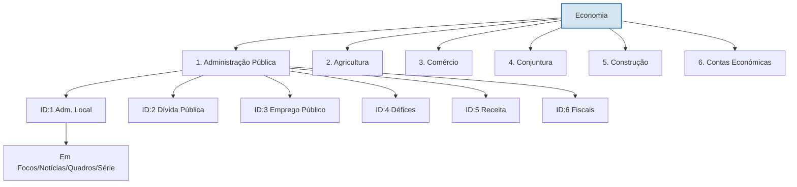

```mermaid
graph TD
    %% Economia
    E[Economia] --> E1[1. Administração Pública]
    E --> E2[2. Agricultura]
    E --> E3[3. Comércio]
    E --> E4[4. Conjuntura]
    E --> E5[5. Construção]
    E --> E6[6. Contas Económicas]

    %% Administração Pública ID:1-6
    E1 --> AP1[ID:1 Adm. Local]
    AP1 --> AP1F[Em Focos/Notícias/Quadros/Série]
    E1 --> AP2[ID:2 Dívida Pública]
    E1 --> AP3[ID:3 Emprego Público]
    E1 --> AP4[ID:4 Défices]
    E1 --> AP5[ID:5 Receita]
    E1 --> AP6[ID:6 Fiscais]

    %% Continue com todos os sub-ramos...

    %% Estilo
    classDef tema fill:#d4e6f1,stroke:#2874a6,stroke-width:2px;
    class E tema;
```