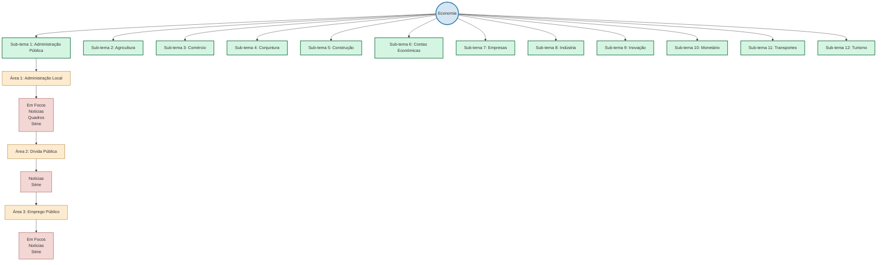

```mermaid
graph TB
   %% Main Theme
   E((Economia))
   
   %% Direct connections to main theme
   E --> ST1[Sub-tema 1: Administração Pública]
   E --> ST2[Sub-tema 2: Agricultura]
   E --> ST3[Sub-tema 3: Comércio]
   E --> ST4[Sub-tema 4: Conjuntura]
   E --> ST5[Sub-tema 5: Construção]
   E --> ST6[Sub-tema 6: Contas Económicas]
   E --> ST7[Sub-tema 7: Empresas]
   E --> ST8[Sub-tema 8: Indústria]
   E --> ST9[Sub-tema 9: Inovação]
   E --> ST10[Sub-tema 10: Monetário]
   E --> ST11[Sub-tema 11: Transportes]
   E --> ST12[Sub-tema 12: Turismo]

   %% Sequential flow
   ST1 --> A1[Área 1: Administração Local]
   A1 --> A1F[Em Focos<br>Notícias<br>Quadros<br>Série]
   A1F --> A2[Área 2: Dívida Pública]
   A2 --> A2F[Notícias<br>Série]
   A2F --> A3[Área 3: Emprego Público]
   A3 --> A3F[Em Focos<br>Notícias<br>Série]

   %% Continue pattern for all areas...

   %% Styling
   classDef tema fill:#d4e6f1,stroke:#2874a6,stroke-width:3px
   classDef subtema fill:#d5f5e3,stroke:#196f3d,stroke-width:2px
   classDef area fill:#fdebd0,stroke:#9c640c,stroke-width:1px
   classDef files fill:#f2d7d5,stroke:#943126,stroke-width:1px

   class E tema
   class ST1,ST2,ST3,ST4,ST5,ST6,ST7,ST8,ST9,ST10,ST11,ST12 subtema
   class A1,A2,A3 area
   class A1F,A2F,A3F files
```