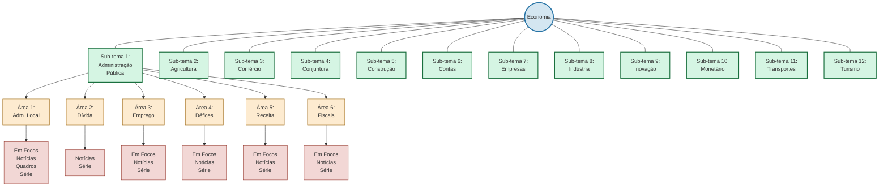

```mermaid
graph TD
    %% Main Node
    E((Economia))
    
    %% Level 1 - Sub-temas
    E --- ST1[Sub-tema 1:<br>Administração<br>Pública]
    E --- ST2[Sub-tema 2:<br>Agricultura]
    E --- ST3[Sub-tema 3:<br>Comércio]
    E --- ST4[Sub-tema 4:<br>Conjuntura]
    E --- ST5[Sub-tema 5:<br>Construção]
    E --- ST6[Sub-tema 6:<br>Contas]
    E --- ST7[Sub-tema 7:<br>Empresas]
    E --- ST8[Sub-tema 8:<br>Indústria]
    E --- ST9[Sub-tema 9:<br>Inovação]
    E --- ST10[Sub-tema 10:<br>Monetário]
    E --- ST11[Sub-tema 11:<br>Transportes]
    E --- ST12[Sub-tema 12:<br>Turismo]

    %% Sub-tema 1 branches
    ST1 --> A1[Área 1:<br>Adm. Local]
    A1 --> A1F[Em Focos<br>Notícias<br>Quadros<br>Série]
    ST1 --> A2[Área 2:<br>Dívida]
    A2 --> A2F[Notícias<br>Série]
    ST1 --> A3[Área 3:<br>Emprego]
    A3 --> A3F[Em Focos<br>Notícias<br>Série]
    ST1 --> A4[Área 4:<br>Défices]
    A4 --> A4F[Em Focos<br>Notícias<br>Série]
    ST1 --> A5[Área 5:<br>Receita]
    A5 --> A5F[Em Focos<br>Notícias<br>Série]
    ST1 --> A6[Área 6:<br>Fiscais]
    A6 --> A6F[Em Focos<br>Notícias<br>Série]

    %% Continue for all areas...
    %% [Previous code truncated for brevity - continues with same pattern]

    %% Styling
    classDef default fill:#f9f9f9,stroke:#333,stroke-width:1px
    classDef tema fill:#d4e6f1,stroke:#2874a6,stroke-width:3px
    classDef subtema fill:#d5f5e3,stroke:#196f3d,stroke-width:2px
    classDef area fill:#fdebd0,stroke:#9c640c,stroke-width:1px
    classDef files fill:#f2d7d5,stroke:#943126,stroke-width:1px

    class E tema
    class ST1,ST2,ST3,ST4,ST5,ST6,ST7,ST8,ST9,ST10,ST11,ST12 subtema
    class A1,A2,A3,A4,A5,A6 area
    class A1F,A2F,A3F,A4F,A5F,A6F files

    %% Layout direction
    direction TB
```