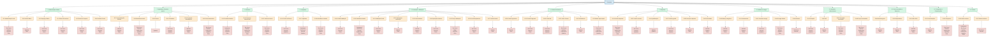

```mermaid
graph TD
    %% Main Node
    E[Economia] --> ST1[1. Administração Pública]
    E --> ST2[2. Agricultura, floresta e pesca]
    E --> ST3[3. Comércio]
    E --> ST4[4. Conjuntura]
    E --> ST5[5. Construção e habitação]
    E --> ST6[6. Contas Económicas]
    E --> ST7[7. Empresas]
    E --> ST8[8. Indústria e energia]
    E --> ST9[9. Inovação e conhecimento]
    E --> ST10[10. Sector monetário e financeiro]
    E --> ST11[11. Transportes e Comunicações]
    E --> ST12[12. Turismo]

    %% Sub-tema 1: Administração Pública
    ST1 --> A1[ID:1 Administração Local]
    A1 --> A1F[Em Focos<br>Notícias<br>Quadros<br>Série]
    ST1 --> A2[ID:2 Dívida Pública]
    A2 --> A2F[Notícias<br>Série]
    ST1 --> A3[ID:3 Emprego Público]
    A3 --> A3F[Em Focos<br>Notícias<br>Série]
    ST1 --> A4[ID:4 Défices Excessivos]
    A4 --> A4F[Em Focos<br>Notícias<br>Série]
    ST1 --> A5[ID:5 Receita e Despesa]
    A5 --> A5F[Em Focos<br>Notícias<br>Série]
    ST1 --> A6[ID:6 Receitas Fiscais]
    A6 --> A6F[Em Focos<br>Notícias<br>Série]

    %% Sub-tema 2: Agricultura
    ST2 --> A7[ID:7 Comercialização banana]
    A7 --> A7F[Notícias<br>Quadros<br>Série]
    ST2 --> A8[ID:8 Estatísticas anuais]
    A8 --> A8F[Em Focos<br>Notícias<br>Publicações<br>Quadros<br>Série]
    ST2 --> A9[ID:9 Floresta]
    A9 --> A9F[Quadros]
    ST2 --> A10[ID:10 Floricultura]
    A10 --> A10F[Em Focos<br>Notícias<br>Quadros]
    ST2 --> A11[ID:11 Produção animal/pesca]
    A11 --> A11F[Notícias<br>Quadros<br>Série]
    ST2 --> A12[ID:12 Recenseamentos]
    A12 --> A12F[Em Focos<br>Notícias<br>Publicações<br>Quadros<br>Série]

    %% Sub-tema 3: Comércio
    ST3 --> A13[ID:13 Produtos Madeira]
    A13 --> A13F[Dashboard<br>Notícias<br>Quadros<br>Série]
    ST3 --> A14[ID:14 Comércio Internacional]
    A14 --> A14F[Em Focos<br>Notícias<br>Publicações<br>Quadros<br>Série]
    ST3 --> A15[ID:15 Comércio interno]
    A15 --> A15F[Em Focos<br>Notícias<br>Quadros<br>Série]

    %% Sub-tema 4: Conjuntura
    ST4 --> A16[ID:16 COVID-19/Guerra]
    A16 --> A16F[Em Focos<br>Notícias<br>Quadros]
    ST4 --> A17[ID:17 Inquéritos]
    A17 --> A17F[Dashboard<br>Em Focos<br>Notícias<br>Quadros]
    ST4 --> A18[ID:18 Indicadores mensais]
    A18 --> A18F[Em Focos<br>Notícias<br>Quadros<br>Série]

    %% Sub-tema 5: Construção
    ST5 --> A19[ID:19 Crédito habitação]
    A19 --> A19F[Em Focos<br>Notícias<br>Série]
    ST5 --> A20[ID:20 Estatísticas anuais]
    A20 --> A20F[Dashboard<br>Em Focos<br>Notícias<br>Publicações<br>Série]
    ST5 --> A21[ID:21 Habitação Social]
    A21 --> A21F[Em Focos<br>Notícias<br>Série]
    ST5 --> A22[ID:22 Indicadores construção]
    A22 --> A22F[Notícias<br>Série]
    ST5 --> A23[ID:23 Licenciamento]
    A23 --> A23F[Notícias<br>Quadros<br>Série]
    ST5 --> A24[ID:24 Operações imóveis]
    A24 --> A24F[Em Focos<br>Notícias<br>Série]
    ST5 --> A25[ID:25 Preços habitação]
    A25 --> A25F[Em Focos<br>Mapa<br>Notícias<br>Série]
    ST5 --> A26[ID:26 Venda alojamentos]
    A26 --> A26F[Em Focos<br>Notícias<br>Série]
    ST5 --> A27[ID:27 Venda cimento]
    A27 --> A27F[Notícias<br>Série]

    %% Sub-tema 6: Contas Económicas
    ST6 --> A28[ID:28 Contas Agricultura]
    A28 --> A28F[Notícias<br>Série]
    ST6 --> A29[ID:29 Contas Regionais]
    A29 --> A29F[Em Focos<br>Notícias<br>Série]
    ST6 --> A30[ID:30 Conta Mar]
    A30 --> A30F[Em Focos<br>Notícias<br>Quadros]
    ST6 --> A31[ID:31 Conta Turismo]
    A31 --> A31F[Em Focos<br>Notícias<br>Publicações<br>Quadros]
    ST6 --> A32[ID:32 Investimento]
    A32 --> A32F[Notícias<br>Série]
    ST6 --> A33[ID:33 Matriz input-output]
    A33 --> A33F[Em Focos<br>Notícias<br>Publicações<br>Quadros]

    %% Sub-tema 7: Empresas
    ST7 --> A34[ID:34 Contas empresas]
    A34 --> A34F[Em Focos<br>Notícias<br>Publicações<br>Quadros<br>Série]
    ST7 --> A35[ID:35 Custos contexto]
    A35 --> A35F[Em Focos<br>Notícias<br>Quadros]
    ST7 --> A36[ID:36 Qualificações]
    A36 --> A36F[Notícias<br>Quadros]
    ST7 --> A37[ID:37 Práticas gestão]
    A37 --> A37F[Em Focos<br>Notícias<br>Quadros]
    ST7 --> A38[ID:38 Serviços empresas]
    A38 --> A38F[Notícias<br>Série]
    ST7 --> A39[ID:39 Sociedades]
    A39 --> A39F[Notícias<br>Quadros<br>Série]

    %% Sub-tema 8: Indústria e energia
    ST8 --> A40[ID:40 Balanço energético]
    A40 --> A40F[Notícias<br>Quadros<br>Série]
    ST8 --> A41[ID:41 Combustíveis]
    A41 --> A41F[Notícias<br>Quadros<br>Série]
    ST8 --> A42[ID:42 Consumo energia]
    A42 --> A42F[Em Focos<br>Notícias<br>Quadros]
    ST8 --> A43[ID:43 Energia elétrica]
    A43 --> A43F[Em Focos<br>Notícias<br>Quadros<br>Série]
    ST8 --> A44[ID:44 Indústria]
    A44 --> A44F[Em Focos<br>Notícias]

    %% Sub-tema 9: Inovação
    ST9 --> A45[ID:45 Inovação]
    A45 --> A45F[Em Focos<br>Notícias<br>Quadros]
    ST9 --> A46[ID:46 I&D]
    A46 --> A46F[Notícias<br>Série]
    ST9 --> A47[ID:47 Sociedade informação]
    A47 --> A47F[Em Focos<br>Notícias<br>Quadros<br>Série]
    ST9 --> A48[ID:48 Preços Consumidor]
    A48 --> A48F[Em Focos<br>Notícias<br>Publicações<br>Quadros<br>Série]

    %% Sub-tema 10: Sector monetário
    ST10 --> A49[ID:49 Banca/seguros]
    A49 --> A49F[Notícias<br>Série]
    ST10 --> A50[ID:50 Empréstimos]
    A50 --> A50F[Notícias<br>Série]
    ST10 --> A51[ID:51 Rede SIBS]
    A51 --> A51F[Notícias<br>Quadros<br>Série]

    %% Sub-tema 11: Transportes
    ST11 --> A52[ID:52 Comunicações]
    A52 --> A52F[Notícias<br>Série]
    ST11 --> A53[ID:53 Transportes]
    A53 --> A53F[Em Focos<br>Notícias<br>Publicações<br>Quadros<br>Série]

    %% Sub-tema 12: Turismo
    ST12 --> A54[ID:54 Oferta turística]
    A54 --> A54F[Dashboards<br>Em Focos<br>Notícias<br>Publicações<br>Quadros<br>Série]
    ST12 --> A55[ID:55 Gastos turísticos]
    A55 --> A55F[Em Focos<br>Notícias]

    %% Styling
    classDef default fill:#f9f9f9,stroke:#333,stroke-width:1px
    classDef tema fill:#d4e6f1,stroke:#2874a6,stroke-width:2px
    classDef subtema fill:#d5f5e3,stroke:#196f3d,stroke-width:1px
    classDef area fill:#fdebd0,stroke:#9c640c,stroke-width:1px
    classDef files fill:#f2d7d5,stroke:#943126,stroke-width:1px

    class E tema
    class ST1,ST2,ST3,ST4,ST5,ST6,ST7,ST8,ST9,ST10,ST11,ST12 subtema
    class A1,A2,A3,A4,A5,A6,A7,A8,A9,A10,A11,A12,A13,A14,A15,A16,A17,A18,A19,A20,A21,A22,A23,A24,A25,A26,A27,A28,A29,A30,A31,A32,A33,A34,A35,A36,A37,A38,A39,A40,A41,A42,A43,A44,A45,A46,A47,A48,A49,A50,A51,A52,A53,A54,A55 area
    class A1F,A2F,A3F,A4F,A5F,A6F,A7F,A8F,A9F,A10F,A11F,A12F,A13F,A14F,A15F,A16F,A17F,A18F,A19F,A20F,A21F,A22F,A23F,A24F,A25F,A26F,A27F,A28F,A29F,A30F,A31F,A32F,A33F,A34F,A35F,A36F,A37F,A38F,A39F,A40F,A41F,A42F,A43F,A44F,A45F,A46F,A47F,A48F,A49F,A50F,A51F,A52F,A53F,A54F,A55F files
```