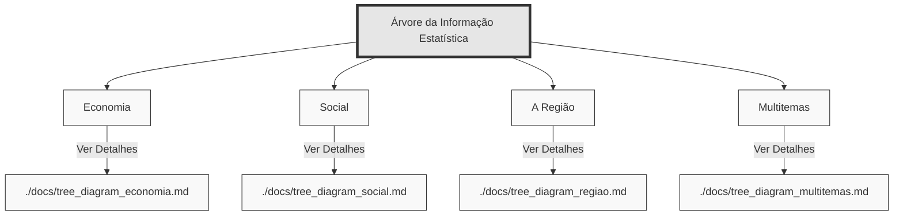

```mermaid
graph TD
    Root[Árvore da Informação Estatística] --> E[Economia]
    Root --> S[Social]
    Root --> R[A Região]
    Root --> M[Multitemas]
    
    %% Links para outros diagramas
    E --> |Ver Detalhes|E_Detail[./docs/tree_diagram_economia.md]
    S --> |Ver Detalhes|S_Detail[./docs/tree_diagram_social.md]
    R --> |Ver Detalhes|R_Detail[./docs/tree_diagram_regiao.md]
    M --> |Ver Detalhes|M_Detail[./docs/tree_diagram_multitemas.md]

    %% Estilo
    classDef default fill:#f9f9f9,stroke:#333,stroke-width:1px;
    classDef root fill:#e6e6e6,stroke:#333,stroke-width:4px;
    class Root root;
```