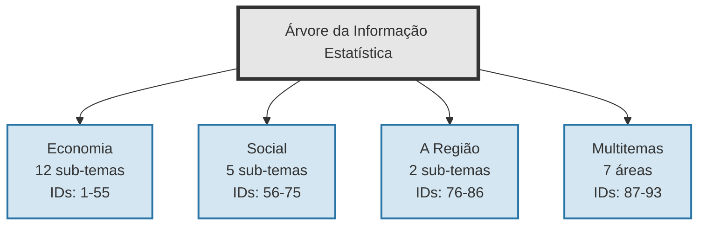

```mermaid
graph TD
    Root[Árvore da Informação Estatística] --> E[Economia<br>12 sub-temas<br>IDs: 1-55]
    Root --> S[Social<br>5 sub-temas<br>IDs: 56-75]
    Root --> R[A Região<br>2 sub-temas<br>IDs: 76-86]
    Root --> M[Multitemas<br>7 áreas<br>IDs: 87-93]

    %% Styling
    classDef default fill:#f9f9f9,stroke:#333,stroke-width:1px
    classDef root fill:#e6e6e6,stroke:#333,stroke-width:4px
    classDef tema fill:#d4e6f1,stroke:#2874a6,stroke-width:2px
    
    class Root root
    class E,S,R,M tema

    %% Links
    click E "./tree_diagram_economia.md"
    click S "./tree_diagram_social.md"
    click R "./tree_diagram_regiao.md"
    click M "./tree_diagram_multitemas.md"
```