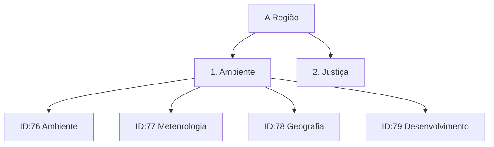

```mermaid
graph TD
    %% A Região
    R[A Região] --> R1[1. Ambiente]
    R --> R2[2. Justiça]

    %% Ambiente ID:76-79
    R1 --> AM1[ID:76 Ambiente]
    R1 --> AM2[ID:77 Meteorologia]
    R1 --> AM3[ID:78 Geografia]
    R1 --> AM4[ID:79 Desenvolvimento]

    %% Continue com todos os sub-ramos...
```