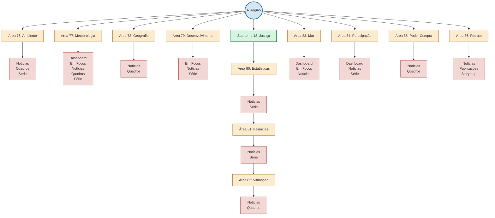

# Diagrama A Região

```mermaid
graph TB
   %% Main Theme
   R((A Região))
   
   %% Direct connections to main theme
   R --> A76[Área 76: Ambiente]
   R --> A77[Área 77: Meteorologia]
   R --> A78[Área 78: Geografia]
   R --> A79[Área 79: Desenvolvimento]
   R --> ST18[Sub-tema 18: Justiça]
   R --> A83[Área 83: Mar]
   R --> A84[Área 84: Participação]
   R --> A85[Área 85: Poder Compra]
   R --> A86[Área 86: Retrato]

   %% Área connections
   A76 --> A76F[Notícias<br>Quadros<br>Série]

   A77 --> A77F[Dashboard<br>Em Focos<br>Notícias<br>Quadros<br>Série]

   A78 --> A78F[Notícias<br>Quadros]

   A79 --> A79F[Em Focos<br>Notícias<br>Série]

   %% Sub-tema 18: Justiça
   ST18 --> A80[Área 80: Estatísticas]
   A80 --> A80F[Notícias<br>Série]
   A80F --> A81[Área 81: Falências]
   A81 --> A81F[Notícias<br>Série]
   A81F --> A82[Área 82: Vitimação]
   A82 --> A82F[Notícias<br>Quadros]

   A83 --> A83F[Dashboard<br>Em Focos<br>Notícias]

   A84 --> A84F[Dashboard<br>Notícias<br>Série]

   A85 --> A85F[Notícias<br>Quadros]

   A86 --> A86F[Notícias<br>Publicações<br>Storymap]

   %% Styling
   classDef tema fill:#d4e6f1,stroke:#2874a6,stroke-width:3px
   classDef subtema fill:#d5f5e3,stroke:#196f3d,stroke-width:2px
   classDef area fill:#fdebd0,stroke:#9c640c,stroke-width:1px
   classDef files fill:#f2d7d5,stroke:#943126,stroke-width:1px

   class R tema
   class ST18 subtema
   class A76,A77,A78,A79,A80,A81,A82,A83,A84,A85,A86 area
   class A76F,A77F,A78F,A79F,A80F,A81F,A82F,A83F,A84F,A85F,A86F files
```