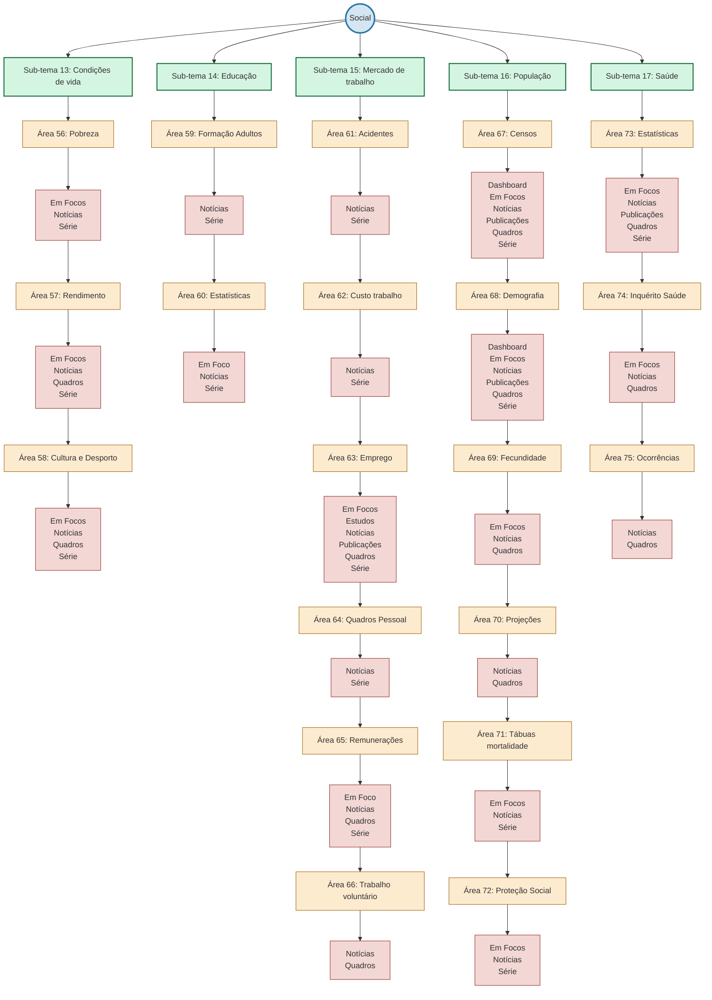

# Diagrama Social

```mermaid
graph TB
   %% Main Theme
   S((Social))
   
   %% Direct connections to main theme
   S --> ST13[Sub-tema 13: Condições de vida]
   S --> ST14[Sub-tema 14: Educação]
   S --> ST15[Sub-tema 15: Mercado de trabalho]
   S --> ST16[Sub-tema 16: População]
   S --> ST17[Sub-tema 17: Saúde]

   %% Sub-tema 13: Condições de vida
   ST13 --> A56[Área 56: Pobreza]
   A56 --> A56F[Em Focos<br>Notícias<br>Série]
   A56F --> A57[Área 57: Rendimento]
   A57 --> A57F[Em Focos<br>Notícias<br>Quadros<br>Série]
   A57F --> A58[Área 58: Cultura e Desporto]
   A58 --> A58F[Em Focos<br>Notícias<br>Quadros<br>Série]

   %% Sub-tema 14: Educação
   ST14 --> A59[Área 59: Formação Adultos]
   A59 --> A59F[Notícias<br>Série]
   A59F --> A60[Área 60: Estatísticas]
   A60 --> A60F[Em Foco<br>Notícias<br>Série]

   %% Sub-tema 15: Mercado trabalho
   ST15 --> A61[Área 61: Acidentes]
   A61 --> A61F[Notícias<br>Série]
   A61F --> A62[Área 62: Custo trabalho]
   A62 --> A62F[Notícias<br>Série]
   A62F --> A63[Área 63: Emprego]
   A63 --> A63F[Em Focos<br>Estudos<br>Notícias<br>Publicações<br>Quadros<br>Série]
   A63F --> A64[Área 64: Quadros Pessoal]
   A64 --> A64F[Notícias<br>Série]
   A64F --> A65[Área 65: Remunerações]
   A65 --> A65F[Em Foco<br>Notícias<br>Quadros<br>Série]
   A65F --> A66[Área 66: Trabalho voluntário]
   A66 --> A66F[Notícias<br>Quadros]

   %% Sub-tema 16: População
   ST16 --> A67[Área 67: Censos]
   A67 --> A67F[Dashboard<br>Em Focos<br>Notícias<br>Publicações<br>Quadros<br>Série]
   A67F --> A68[Área 68: Demografia]
   A68 --> A68F[Dashboard<br>Em Focos<br>Notícias<br>Publicações<br>Quadros<br>Série]
   A68F --> A69[Área 69: Fecundidade]
   A69 --> A69F[Em Focos<br>Notícias<br>Quadros]
   A69F --> A70[Área 70: Projeções]
   A70 --> A70F[Notícias<br>Quadros]
   A70F --> A71[Área 71: Tábuas mortalidade]
   A71 --> A71F[Em Focos<br>Notícias<br>Série]
   A71F --> A72[Área 72: Proteção Social]
   A72 --> A72F[Em Focos<br>Notícias<br>Série]

   %% Sub-tema 17: Saúde
   ST17 --> A73[Área 73: Estatísticas]
   A73 --> A73F[Em Focos<br>Notícias<br>Publicações<br>Quadros<br>Série]
   A73F --> A74[Área 74: Inquérito Saúde]
   A74 --> A74F[Em Focos<br>Notícias<br>Quadros]
   A74F --> A75[Área 75: Ocorrências]
   A75 --> A75F[Notícias<br>Quadros]

   %% Styling
   classDef tema fill:#d4e6f1,stroke:#2874a6,stroke-width:3px
   classDef subtema fill:#d5f5e3,stroke:#196f3d,stroke-width:2px
   classDef area fill:#fdebd0,stroke:#9c640c,stroke-width:1px
   classDef files fill:#f2d7d5,stroke:#943126,stroke-width:1px

   class S tema
   class ST13,ST14,ST15,ST16,ST17 subtema
   class A56,A57,A58,A59,A60,A61,A62,A63,A64,A65,A66,A67,A68,A69,A70,A71,A72,A73,A74,A75 area
   class A56F,A57F,A58F,A59F,A60F,A61F,A62F,A63F,A64F,A65F,A66F,A67F,A68F,A69F,A70F,A71F,A72F,A73F,A74F,A75F files
```