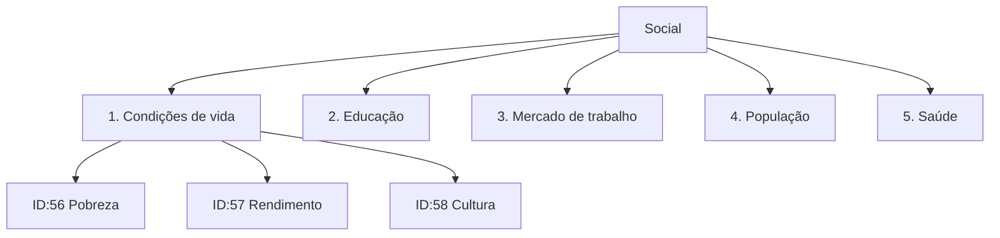

```mermaid
graph TD
    %% Social
    S[Social] --> S1[1. Condições de vida]
    S --> S2[2. Educação]
    S --> S3[3. Mercado de trabalho]
    S --> S4[4. População]
    S --> S5[5. Saúde]

    %% Condições de vida ID:56-58
    S1 --> CV1[ID:56 Pobreza]
    S1 --> CV2[ID:57 Rendimento]
    S1 --> CV3[ID:58 Cultura]

    %% Continue com todos os sub-ramos...
```